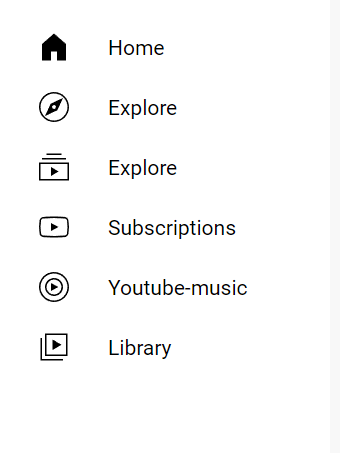

# YouTube-clone

This project is a simple YouTube clone built using HTML and CSS. It was created as a practice project to better understand front-end development.

## Features

- **Video Navigation**: You can click on a video or its title to open the video.
- **Profile Hover Info**: Hovering over the profile picture will display channel information in a small popup window.

 

- **Navigation Icons**: The page includes navigation icons similar to YouTube.

   

- **Search Bar**: A search bar is present but does not have functional interaction, as the site is intended for practice purposes.

- **Responsive Design**: The site adjusts its layout for optimal viewing on different screen sizes. When the window width is less than 1000 pixels, the layout changes to display three videos per row instead of four, and the navigation bar becomes more compact

## Usage
-Click on any video or title to open the video.
-Hover over the profile picture to see channel information.

## License
This project is open source and available under the MIT License.
